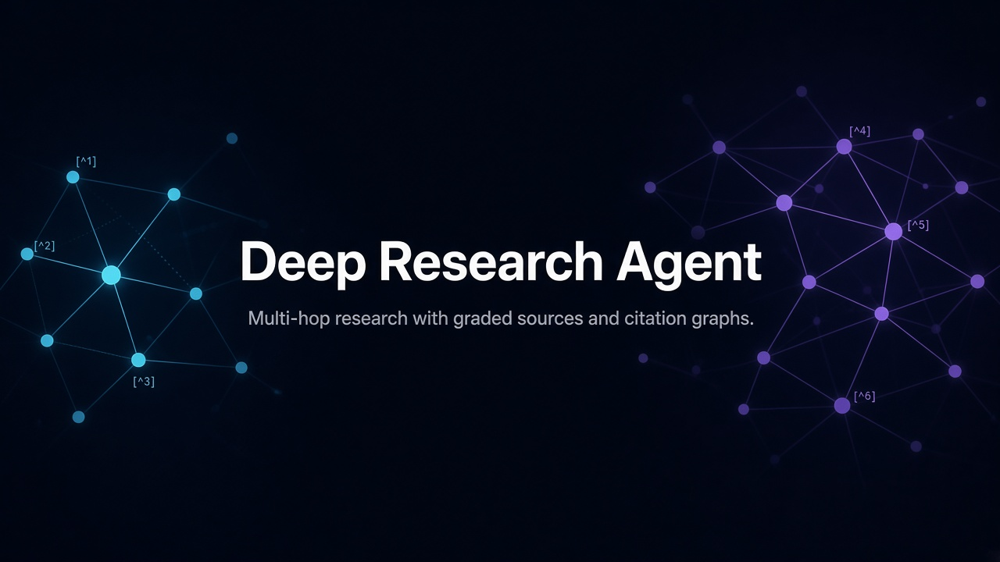
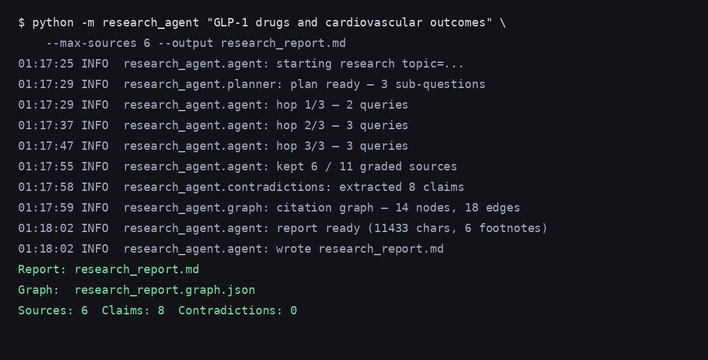
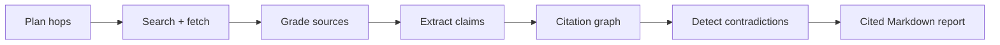

# Deep Research Agent

CLI research agent that plans multi-hop questions, grades public sources, builds a citation graph, flags contradictions, and writes a fully cited Markdown report — evidence in, not just chat out.




## Why this exists

Most “research agents” summarize whatever the model already knows. This one **resolves a topic against live sources**:

- Plans 3 hops of sub-questions and search queries
- Searches DuckDuckGo, fetches pages (`httpx` + `trafilatura`)
- Grades credibility / relevance / recency
- Extracts claims → citation graph (assert / support / contradict)
- Surfaces contradictions with pointers to both sides
- Emits a footnote-cited Markdown report + graph JSON

Read-only by default: GET-only fetches, public `http(s)` only, timeouts, size caps, no form posts, no page JS execution.

## Demo



Sample output from a GLP-1 / cardiovascular outcomes run: **[examples/sample_report.md](examples/sample_report.md)**

```text
Report: research_report.md
Graph:  research_report.graph.json
Sources: 6  Claims: 8  Contradictions: 0
```

## Architecture



## Quickstart

```bash
python -m venv .venv
source .venv/bin/activate   # Windows: .venv\Scripts\activate
pip install -e ".[dev]"
cp .env.example .env        # set OPENAI_API_KEY
```

`.env` keys (see `.env.example`):

| Variable | Required | Notes |
| --- | --- | --- |
| `OPENAI_API_KEY` | yes (live runs) | Tests mock the LLM |
| `OPENAI_BASE_URL` | no | Azure / Groq / Ollama / OpenRouter / any `/v1` |
| `OPENAI_MODEL` | no | Default `gpt-4o-mini`; override with `--model` |

```bash
python -m research_agent "GLP-1 drugs and cardiovascular outcomes" \
  --max-sources 6 \
  --output research_report.md \
  --model gpt-4o-mini
```

Or after install: `research-agent "your topic" --max-sources 6`

| Flag | Meaning |
| --- | --- |
| `--max-sources` | Cap on graded sources kept |
| `--output` | Markdown report path |
| `--model` | Per-run model override |
| `--graph-json` | Graph JSON path (default: alongside `--output`) |
| `--no-mermaid` | Skip Mermaid block in the report |
| `-v` | Debug logs on stderr |

## Sample output highlights

The report includes:

- Executive summary and cited sections (`[^1]` footnotes)
- Research plan (hops + queries)
- Contradictions with **Side A / Side B** source pointers
- Citation graph summary + optional Mermaid
- Footnotes and a source appendix with grades and extracted claims

See [examples/sample_report.md](examples/sample_report.md) for a full example on GLP-1 drugs and cardiovascular outcomes.

## Safety defaults

- **GET-only** HTTP(S); no credentials in URLs
- Blocks localhost / private / link-local / metadata IPs
- Fetch timeout + max body size
- No login, paywall clicking, or executing page JavaScript
- Agent writes only the local report / graph files you ask for

## Project layout

```text
research_agent/          planner, search, fetch, grading, graph, report, CLI
tests/                   mocked unit tests (no network / API key)
examples/sample_report.md
docs/assets/             banner + CLI demo
pyproject.toml
.env.example
```

```bash
pip install -e ".[dev]"
pytest
```

## Limits

- Search quality tracks DuckDuckGo HTML results.
- Grading is heuristic (domain + lexical overlap + date), not a trust oracle.
- Live quality tracks whatever model you point `OPENAI_BASE_URL` at.
- Paywalled or JS-only pages will not be fully extracted.
