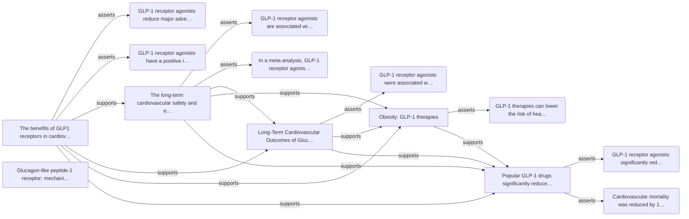

# GLP-1 Drugs and Cardiovascular Outcomes

_Generated 2026-09-13 23:18 UTC by Deep Research Agent (`gpt-4o-mini`). Read-only web research. Treat citations as starting points, not verdicts._

## Topic

GLP-1 drugs and cardiovascular outcomes

## Executive summary

GLP-1 receptor agonists have been shown to reduce major adverse cardiovascular events (MACE) in patients with type 2 diabetes compared to placebo, with various studies reporting significant reductions in cardiovascular mortality and non-fatal myocardial infarction [^1][^2]. While there is a consensus on their positive impact on cardiovascular risk factors, some nuances in the data warrant further investigation [^3][^4].

## Efficacy of GLP-1 Receptor Agonists

GLP-1 receptor agonists have been associated with a reduction in MACE, with a hazard ratio of 0.86 indicating a significant benefit compared to placebo [^2]. Additionally, a systematic review found a risk ratio of 0.88 for reducing MACE in patients receiving GLP-1 therapies [^3]. These findings suggest a consistent efficacy across multiple studies.

## Impact on Cardiovascular Risk Factors

GLP-1 receptor agonists positively influence cardiovascular risk factors, including obesity, blood pressure, and blood lipid levels [^1][^2]. This multifaceted approach to risk reduction may contribute to the observed decreases in cardiovascular events, as these factors are critical in the management of cardiovascular health [^4].

## Cardiovascular Mortality

Evidence indicates that GLP-1 receptor agonists can lead to a reduction in cardiovascular mortality, with studies reporting a 13% decrease compared to placebo [^6]. Furthermore, these drugs have been linked to a 14% lower likelihood of experiencing serious cardiovascular events such as heart attacks and strokes [^6].

## Open Questions and Disagreements

Despite the positive findings, some questions remain regarding the long-term safety and efficacy of GLP-1 receptor agonists in diverse populations [^2]. Additionally, while many studies report significant benefits, the extent of these benefits may vary based on individual patient characteristics and comorbidities, highlighting the need for personalized treatment approaches [^3][^4].

## Research plan

This sequence allows for a comprehensive understanding of GLP-1 drugs, starting from foundational knowledge, moving to their effects on cardiovascular outcomes, and finally exploring the ongoing debates and recent developments in the field.

- **Hop 1.** What are GLP-1 drugs and how do they function? — `definition of GLP-1 drugs`, `mechanism of action of GLP-1 receptor agonists`
- **Hop 2.** What evidence exists regarding the cardiovascular outcomes associated with GLP-1 drugs? — `GLP-1 drugs cardiovascular outcomes studies`, `clinical trials GLP-1 receptor agonists heart health`
- **Hop 3.** What are the current debates and limitations regarding the use of GLP-1 drugs for cardiovascular outcomes? — `debate on GLP-1 drugs cardiovascular safety`, `recent changes in guidelines for GLP-1 receptor agonists`

## Contradictions

No direct contradictions were detected among the extracted claims.

## Citation graph summary

6 sources and 8 claims. Edges: 8 asserts, 10 support, 0 contradict.

## Sources

[^1]: **The benefits of GLP1 receptors in cardiovascular diseases**. https://pmc.ncbi.nlm.nih.gov/articles/PMC10739421/ (published 2023-12-08; accessed 2026-09-13; domain `pmc.ncbi.nlm.nih.gov`; hop 2; grade 0.91 — credibility=0.95 relevance=0.93 recency=0.75).
[^2]: **The long-term cardiovascular safety and efficacy of glucagon-like peptide-1 (GLP-1) receptor agonists in high-risk cardiovascular populations: a systematic review and meta-analysis - Cardiovascular Diabetology – Endocrinology Reports**. https://link.springer.com/article/10.1186/s40842-026-00295-3 (published 2026-05-01; accessed 2026-09-13; domain `link.springer.com`; hop 3; grade 0.89 — credibility=0.95 relevance=0.80 recency=1.00).
[^3]: **Long-Term Cardiovascular Outcomes of Glucagon-Like Peptide-1 (GLP-1) Receptor Agonists in Type 2 Diabetes: A Systematic Review**. https://pmc.ncbi.nlm.nih.gov/articles/PMC11578637/ (published 2024-11-14; accessed 2026-09-13; domain `pmc.ncbi.nlm.nih.gov`; hop 3; grade 0.81 — credibility=0.95 relevance=0.70 recency=0.75).
[^4]: **Obesity: GLP-1 therapies**. https://www.who.int/news-room/questions-and-answers/item/obesity-glp-1-therapies (published 2025-12-01; accessed 2026-09-13; domain `www.who.int`; hop 1; grade 0.78 — credibility=0.95 relevance=0.56 recency=1.00).
[^5]: **Glucagon-like peptide-1 receptor: mechanisms and advances in therapy - Signal Transduction and Targeted Therapy**. https://www.nature.com/articles/s41392-024-01931-z (published 2024-09-18; accessed 2026-09-13; domain `www.nature.com`; hop 1; grade 0.74 — credibility=0.95 relevance=0.55 recency=0.75).
[^6]: **Popular GLP-1 drugs significantly reduce major cardiovascular events,**. https://www.news-medical.net/news/20260506/Popular-GLP-1-drugs-significantly-reduce-major-cardiovascular-events.aspx (published 2026-05-06; accessed 2026-09-13; domain `www.news-medical.net`; hop 3; grade 0.73 — credibility=0.55 relevance=0.80 recency=1.00).

## Source appendix

### S1 — The benefits of GLP1 receptors in cardiovascular diseases

- Footnote: [^1]
- URL: https://pmc.ncbi.nlm.nih.gov/articles/PMC10739421/
- Query: `GLP-1 drugs cardiovascular outcomes clinical trials`
- Grade: credibility=0.95 relevance=0.93 recency=0.75
- Excerpt: Abstract Glucagon like peptide-1 (GLP-1) receptor agonists are well established drugs for the treatment of type 2 diabetes (T2D). In addition to glycemic control, GLP-1 receptor agonists have beneficial other effects. They act by binding to GLP-1 receptors, which are widely distributed in the body, including cardiomyoc

Claims:
- C1: GLP-1 receptor agonists reduce major adverse cardiovascular events (MACE) in patients with type 2 diabetes compared to placebo.
- C2: GLP-1 receptor agonists have a positive impact on cardiovascular risk factors such as obesity, blood pressure, and blood lipid levels.

### S2 — The long-term cardiovascular safety and efficacy of glucagon-like peptide-1 (GLP-1) receptor agonists in high-risk cardiovascular populations: a systematic review and meta-analysis - Cardiovascular Diabetology – Endocrinology Reports

- Footnote: [^2]
- URL: https://link.springer.com/article/10.1186/s40842-026-00295-3
- Query: `long-term cardiovascular effects of GLP-1 drugs in diverse populations`
- Grade: credibility=0.95 relevance=0.80 recency=1.00
- Excerpt: Abstract Background Glucagon-like peptide-1 receptor agonists (GLP-1RAs) are widely used for the management of type 2 diabetes and obesity, yet their long-term cardiovascular effects in high-risk populations continue to be actively evaluated. Given emerging evidence of both metabolic and direct cardiovascular actions, 

Claims:
- C3: GLP-1 receptor agonists are associated with a significant reduction in MACE compared with placebo, with a hazard ratio of 0.86.
- C4: In a meta-analysis, GLP-1 receptor agonists demonstrated significant reductions in cardiovascular mortality and non-fatal myocardial infarction.

### S3 — Long-Term Cardiovascular Outcomes of Glucagon-Like Peptide-1 (GLP-1) Receptor Agonists in Type 2 Diabetes: A Systematic Review

- Footnote: [^3]
- URL: https://pmc.ncbi.nlm.nih.gov/articles/PMC11578637/
- Query: `long-term cardiovascular effects of GLP-1 drugs in diverse populations`
- Grade: credibility=0.95 relevance=0.70 recency=0.75
- Excerpt: Abstract Glucagon-like peptide-1 receptor agonists (GLP-1 RAs) have emerged as a promising class of medications for type 2 diabetes (T2D) management. While their glucose-lowering effects are well-established, their long-term impact on cardiovascular outcomes remains a subject of ongoing research and debate. This system

Claims:
- C5: GLP-1 receptor agonists were associated with a risk ratio of 0.88 for reducing MACE compared to placebo or standard care.

### S4 — Obesity: GLP-1 therapies

- Footnote: [^4]
- URL: https://www.who.int/news-room/questions-and-answers/item/obesity-glp-1-therapies
- Query: `definition of GLP-1 drugs`
- Grade: credibility=0.95 relevance=0.56 recency=1.00
- Excerpt: Obesity: GLP-1 therapies 2 December 2025 | Questions and answers GLP-1 therapies (glucagon-like peptide-1 receptor agonists) are a class of medications that mimic the natural GLP-1 hormone, which helps regulate blood sugar and appetite. They were originally used for managing type 2 diabetes, but are now also approved f

Claims:
- C6: GLP-1 therapies can lower the risk of heart attack, stroke, and heart failure.

### S5 — Glucagon-like peptide-1 receptor: mechanisms and advances in therapy - Signal Transduction and Targeted Therapy

- Footnote: [^5]
- URL: https://www.nature.com/articles/s41392-024-01931-z
- Query: `mechanism of action of GLP-1 receptor agonists`
- Grade: credibility=0.95 relevance=0.55 recency=0.75
- Excerpt: Abstract The glucagon-like peptide-1 (GLP-1) receptor, known as GLP-1R, is a vital component of the G protein-coupled receptor (GPCR) family and is found primarily on the surfaces of various cell types within the human body. This receptor specifically interacts with GLP-1, a key hormone that plays an integral role in r

### S6 — Popular GLP-1 drugs significantly reduce major cardiovascular events,

- Footnote: [^6]
- URL: https://www.news-medical.net/news/20260506/Popular-GLP-1-drugs-significantly-reduce-major-cardiovascular-events.aspx
- Query: `long-term cardiovascular effects of GLP-1 drugs in diverse populations`
- Grade: credibility=0.55 relevance=0.80 recency=1.00
- Excerpt: Widely used diabetes and obesity drugs show powerful heart-protective effects in high-risk patients, offering new momentum for their role in reducing cardiovascular deaths. Study: The long-term cardiovascular safety and efficacy of glucagon-like peptide-1 (GLP-1) receptor agonists in high-risk cardiovascular population

Claims:
- C7: GLP-1 receptor agonists significantly reduce the likelihood of experiencing a heart attack, stroke, or cardiovascular death by 14%.
- C8: Cardiovascular mortality was reduced by 13% in patients treated with GLP-1 receptor agonists compared to placebo.
